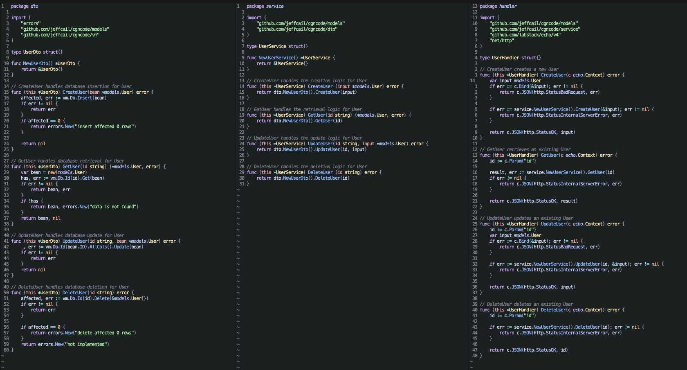
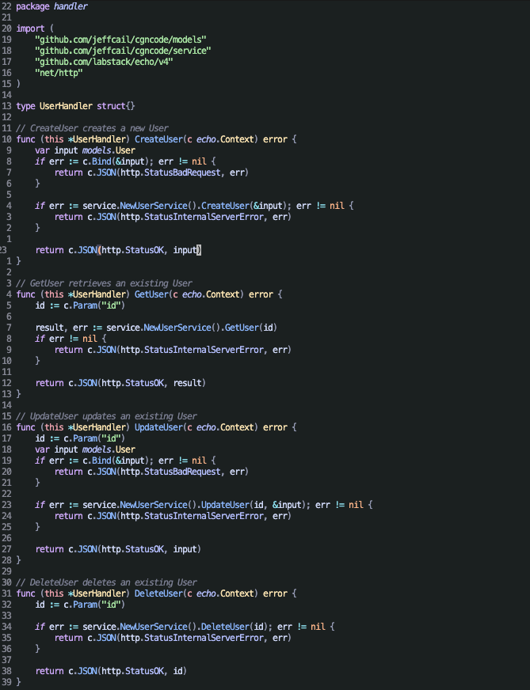
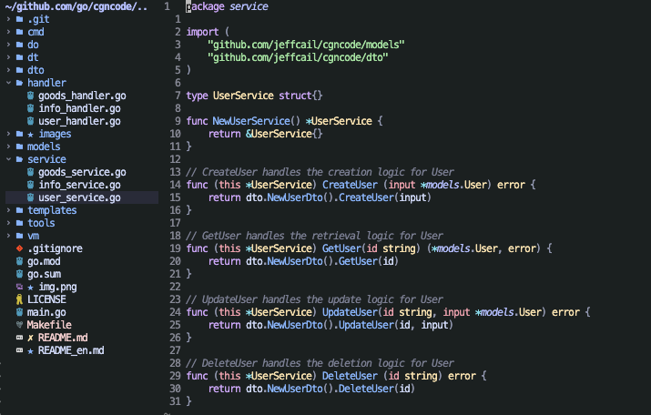

### <p align="center">cgncode</p>
#### <p align="center">自动生成curd代码, 已经生成的代码，不会重复生成</p>
#### <p align="center"><a href="https://github.com/jeffcail/cgncode/releases"></a><a href="https://github.com/jeffcail/cgncode/blob/master/LICENSE"></a><p>
#### <p align="center"><a href="./README.md" target="_blank">简体中文</a> | <a href="./README_en.md" target="_blank">English</a> </p>

## 帮助
```shell
make help
```
```shell
Usage:
  cgncode [flags]
  cgncode [command]

Available Commands:
  code        A brief description of your command
  completion  Generate the autocompletion script for the specified shell
  dto         A brief description of your command
  handler     A brief description of your command
  help        Help about any command
  service     A brief description of your command

Flags:
  -h, --help   help for cgncode
```

## 使用
1. 生成 controller、service、dto代码
```shell
make code
```
效果:



2. 生成 controller代码
```shell
make h 
```
效果:



3. 生成 service代码
```shell
make s 
```
效果:



4. 生成 dto代码
```shell
make d
```
效果:

