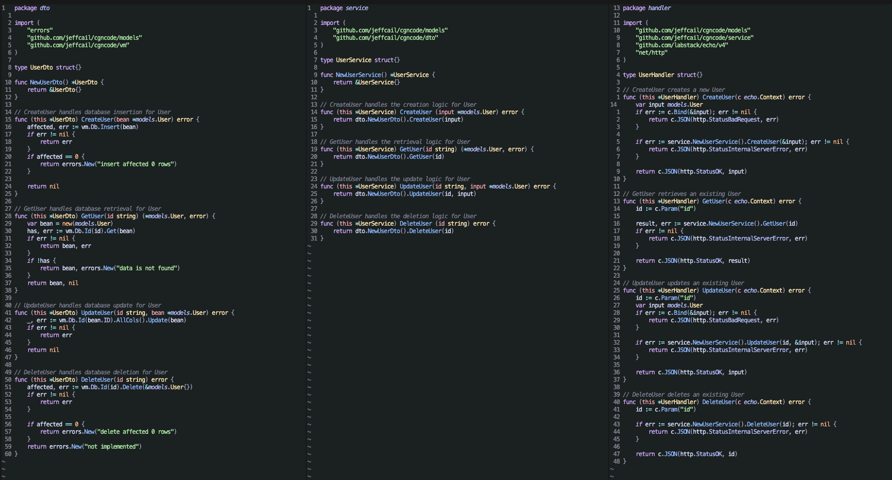
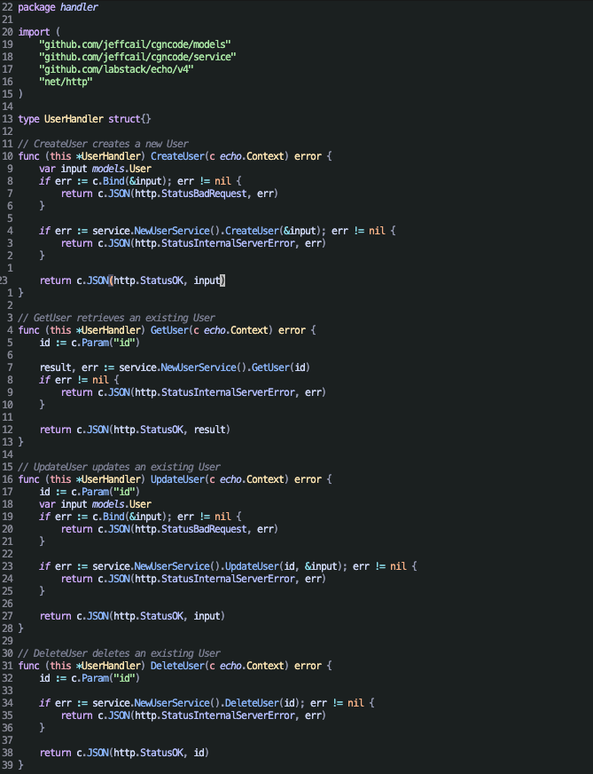
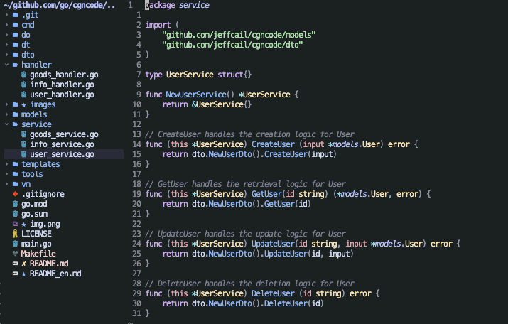
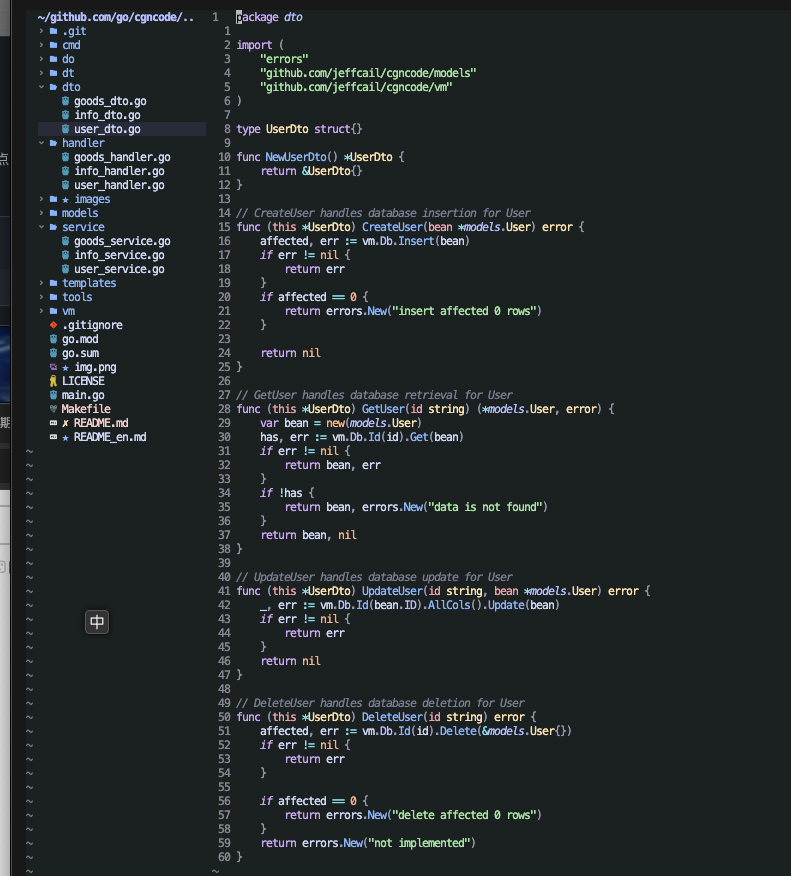

### <p align="center">cgncode</center>
#### <p align="center">Automatically generate curd code, already generated code will not be generated repeatedly</p>
#### <p align="center"><a href="https://github.com/jeffcail/cgncode/releases"></a><a href="https://github.com/jeffcail/cgncode/blob/master/LICENSE"></a></p>
#### <p align="center"><a href="./README.md" target="_blank">Simplified Chinese</a> | <a href="./README_en.md" target="_blank">English</a></p>

## Help command
```shell
make help
```
```shell
Usage:
  cgncode [flags]
  cgncode [command]

Available Commands:
  code        A brief description of your command
  completion  Generate the autocompletion script for the specified shell
  dto         A brief description of your command
  handler     A brief description of your command
  help        Help about any command
  service     A brief description of your command

Flags:
  -h, --help   help for cgncode
```

## Usage
1. Generate controller, service, dto code
```shell
make code
```
effect:



2. Only generate controller code
```shell
make h 
```
effect:



3. Only generate service code
```shell
make s 
```
effect:



4. Only generate dto code
```shell
make d
```
effect:

